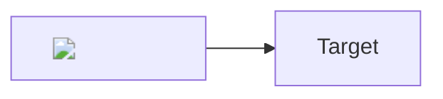

# Stored XSS via Mermaid Rendering Leads to Persistent Account Takeover

**Package:** open-webui (pip) / ghcr.io/open-webui/open-webui (Docker)
**Affected versions:** <= 0.9.1
**Severity:** High — CVSS:3.1/AV:N/AC:L/PR:L/UI:R/S:C/C:H/I:H/A:N (8.7)

## Summary

Mermaid diagrams are rendered with `securityLevel: 'loose'` and inserted via `wrapper.innerHTML = svg` without DOMPurify sanitization in `FilePreview.svelte`. A verified user uploads a `.md` file containing a mermaid XSS payload. When an OAuth-authenticated victim opens the file, the payload fires, steals the JWT cookie (which lacks `HttpOnly` on the OAuth code path), and exfiltrates it. CORS wildcard origin reflection allows the attacker to use the stolen token from any domain. Token revocation is a no-op without Redis, so the attacker retains access for up to 4 weeks after the victim logs out.

## Details

**XSS entry point — `src/lib/utils/index.ts:1739`:**

```typescript
mermaid.initialize({
    startOnLoad: false,
    theme: document.documentElement.classList.contains('dark') ? 'dark' : 'default',
    securityLevel: 'loose'  // allows arbitrary HTML in node labels
});
```

**Unsafe rendering — `src/lib/components/chat/FileNav/FilePreview.svelte:140`:**

```typescript
wrapper.innerHTML = svg;  // no DOMPurify — XSS fires here
```

The chat message path (`SVGPanZoom.svelte`) correctly uses `DOMPurify.sanitize()`. FilePreview does not — this is an inconsistency in the same codebase. `DOMPurify` is imported at `FilePreview.svelte:4` but unused in the mermaid path.

**Cookie theft — `backend/open_webui/utils/oauth.py:1720-1727`:**

```python
response.set_cookie(
    key='token',
    value=jwt_token,
    httponly=False,  # JWT readable by document.cookie
)
```

Password login at `auths.py:127-134` correctly uses `httponly=True` — direct inconsistency.

**CORS amplification — `backend/open_webui/config.py:1756`, `main.py:1390-1396`:**

`CORS_ALLOW_ORIGIN` defaults to `'*'` with `allow_credentials=True`. Starlette reflects any `Origin` header back as `Access-Control-Allow-Origin` with `Access-Control-Allow-Credentials: true`, allowing cross-origin API reads with the stolen token.

**No revocation — `backend/open_webui/utils/auth.py:229-276`:**

`invalidate_token()` and `is_valid_token()` are gated behind `if request.app.state.redis:`. Without Redis (default), signout does nothing. Tokens remain valid until `JWT_EXPIRES_IN` (default `4w`).

## PoC

Malicious `.md` file content (upload via FileNav or API):

````markdown
# Harmless Title


````

1. Verified attacker uploads this `.md` file
2. Victim with OAuth session opens the file in FileNav viewer
3. XSS fires: `wrapper.innerHTML = svg` executes the `` payload
4. `document.cookie` (containing `token=<jwt>`) sent to attacker
5. Attacker uses token from `https://evil.example.com` — CORS reflects origin, browser permits read
6. Victim logs out — token still valid (no Redis)

**Live-confirmed:** CORS reflection verified (4/4 origins reflected with `credentials: true`). Token valid after signout confirmed. OAuth `httponly=False` and mermaid `securityLevel: 'loose'` + missing DOMPurify confirmed via code review. Full browser-based OAuth chain was not executed in this pass.

Full PoC scripts: `exploit_mermaid_xss.py`, `exploit_cors_origin_reflection.py`, `exploit_cors_chain.py`, `exploit_token_revocation_bypass.py`

## Impact

Any verified user can upload a file that executes JavaScript in the browser of any user who views it. For OAuth-authenticated users, this leads to persistent account takeover: the stolen token works cross-origin and cannot be revoked for up to 4 weeks. If the victim is an admin, the attacker gains access to all API keys and user data. Affects **all** deployments regardless of JWT secret configuration. CVSS 8.7 (`CVSS:3.1/AV:N/AC:L/PR:L/UI:R/S:C/C:H/I:H/A:N`).

**Full audit report:** https://github.com/tempcollab/open-webui/blob/main/autofyn_audit/audit_report.md
